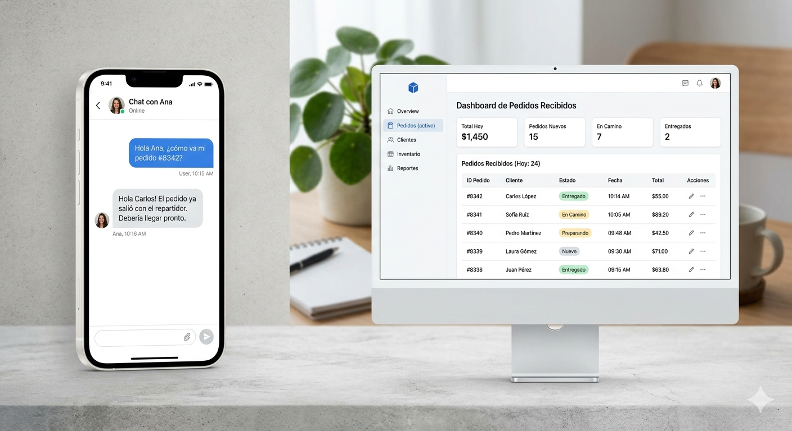

# 🤖 FlowPilot | Vertical AI Workspace



## 🌐 Enlaces del Proyecto
- **Demo en Vivo (Vercel):** https://flowpilot-landing-3j9dx7f60-hanchoskys-projects.vercel.app
- **Repositorio:** https://github.com/hanchosky/flowpilot-landing

---

## ⚡ El Futuro de la Gastronomía Automatizada

**FlowPilot** no es solo una landing page; es la puerta de entrada a un ecosistema de IA diseñado para eliminar la fricción en la toma de pedidos. Implementada con un enfoque **Senior**, esta plataforma combina estética de alto impacto con una arquitectura técnica robusta.

### 💎 Diferenciadores de Diseño (UI/UX)
- **Typographic Scale:** Uso de jerarquía visual agresiva con fuentes masivas para un impacto inmediato.
- **Glassmorphism 2.0:** Navbar con desenfoque de fondo ultra-claro.
- **Dark Mode Premium:** Paleta de colores basada en `#020617` para un contraste superior.
- **Micro-interacciones:** Feedback táctil optimizado para sensación de aplicación nativa en móviles.

---

## 🛠️ Stack Tecnológico de Última Generación

| Tecnología | Rol en el Proyecto |
|------------|--------------------|
| **React 19** | Motor de la interfaz con Hooks modernos |
| **Vite** | Tooling de alto rendimiento para el bundling |
| **Tailwind CSS v4** | Estilizado atómico con últimas capacidades de diseño |
| **Lucide Icons** | Iconografía minimalista y consistente |

---

## 🚀 Instalación y Despliegue Rápido

Sigue estos pasos para levantar el entorno de desarrollo en segundos:

### 1. Clonar el repositorio
```bash
git clone https://github.com/hanchosky/flowpilot-landing.git
cd flowpilot-landing

2. Instalación Limpia
bash
npm install

3. Lanzar el Servidor
bash
npm run dev

El proyecto se ejecutará en: http://localhost:5173/

📂 Estructura de Archivos Optimizada
text
├── src/
│   ├── assets/          # Recursos y multimedia (bot.png)
│   ├── App.tsx          # Lógica central y diseño de la Landing
│   └── index.css        # Configuración Global y Animaciones GPU
├── package.json         # Dependencias y scripts
└── tailwind.config.js   # Configuración de diseño (v4 auto-config)

👨‍💻 Decisiones de Arquitectura y Estrategia de Negocio
Enfoque en Validación de Interés (Estrategia): Sector gastronómico como "Vertical Slice" para demostrar cómo FlowPilot organiza ideas, tareas y decisiones de forma tangible.

Gestión de Assets vía Vite: Centralización en src/assets para que Vite procese, optimice y gestione caché.

GPU Acceleration & Performance: Uso de translate3d y will-change para 60 FPS constantes y excelente LCP.

Resiliencia Táctica y UX Móvil: Prefijos active: y clases touch-manipulation para feedback visual instantáneo.

Arquitectura Zero Dependencies: Sin librerías externas de animaciones, solo Tailwind CSS v4.

🤖 Uso de Herramientas de IA en el Desarrollo
Brainstorming de Negocio: Definición del "Vertical Slice" gastronómico.

Optimización de Estilos: Generación de estructuras base de Tailwind CSS.

Refactorización de Código: Mejores prácticas en React 19 y Tailwind v4.

🚀 Próximos Pasos (Roadmap de Escalabilidad)
Integración de IA en Tiempo Real (WebSockets)

Dashboard de Analítica para visualizar ROI

Pruebas de Usuario (A/B Testing)

Internacionalización (i18n)

✉️ Contacto y Colaboración
Desarrollado por Héctor Hans Olave Trujillo
Senior FullStack & Mobile Developer